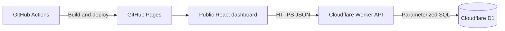

# The Million Beer Project

One crew. One impossible number. By 2035.

The Million Beer Project is a public, responsive dashboard for a collective challenge to record 1,000,000 beers before January 1, 2035. Anyone can read the live scoreboard. Crew members with the shared code can append positive entries or explicit negative corrections.

- Live site: <https://Arhaan2.github.io/million-beers-by-2035/>
- API health: <https://million-beers-api.arhaan2.workers.dev/health>

This is a counter, not a consumption recommendation. It never calculates a per-person target.

## Architecture



The browser never mutates repository files and contains no GitHub token, crew code, session-signing secret, or database credential. The only public build-time configuration is the Worker URL.

## Features

- Live total, visible low-percentage progress, countdown, group pace math, milestones, and projected finish
- 30-day accessible SVG trend, recent append-only activity, and net contributor leaderboard
- Keyboard-accessible shared-code login and update modals
- Positive quick additions, custom amounts, and confirmed negative corrections
- Session tokens kept in `sessionStorage`; optional nickname kept in `localStorage`
- Polling every 25 seconds while visible with last-known-good data preserved on transient failures
- Signed 12-hour editor sessions, hashed-IP rate limits, idempotent submissions, and atomic D1 aggregate updates
- Reduced-motion support, semantic landmarks, focus styles, live regions, mobile layouts, and no analytics

## Repository layout

```text
apps/web/       React, TypeScript, Vite, Vitest, and static assets
apps/api/       Cloudflare Worker, D1 migration, and Workers-runtime tests
scripts/        Production-safe net-zero smoke test
.github/        GitHub Pages workflow
```

## Requirements

- Node.js 24 (use `nvm use`)
- npm
- GitHub CLI (`gh`)
- Wrangler authentication (`npx wrangler login`)
- OpenSSL for random local and production secrets

## Local setup

```bash
nvm use
npm ci
cp apps/api/.dev.vars.example apps/api/.dev.vars
```

Replace every placeholder in `apps/api/.dev.vars`. Use a development-only crew code and at least 32 random bytes for both signing values:

```bash
openssl rand -hex 32
```

Never commit `.dev.vars`; it is ignored. Apply the local migration and start each application in a separate terminal:

```bash
npm run db:migrate:local
npm run dev:api
npm run dev:web
```

The local dashboard runs at `http://localhost:5173` and calls `http://localhost:8787` from `apps/web/.env.example` / `.env.test` configuration.

## Quality commands

```bash
npm run format:check
npm run lint
npm run typecheck
npm test
npm run build
```

Worker tests use Cloudflare's current Vitest integration inside the Workers runtime. D1 migrations are applied to isolated test storage before integration tests.

## D1 and Worker deployment

The Worker name is `million-beers-api`; the binding is `DB`; the database name is `million-beers-production`.

```bash
cd apps/api
npx wrangler d1 create million-beers-production
# Put the returned database_id in wrangler.jsonc.
npx wrangler d1 migrations apply million-beers-production --remote
npx wrangler secret put BEER_ADMIN_PIN
npx wrangler secret put SESSION_SIGNING_SECRET
npx wrangler secret put RATE_LIMIT_SALT
npx wrangler deploy
```

Generate the signing secret and rate-limit salt independently with `openssl rand -hex 32`. Enter them directly at Wrangler's prompt. Do not save production values in the repository or a Vite variable.

To rotate the crew code securely:

```bash
cd apps/api && npx wrangler secret put BEER_ADMIN_PIN
```

Existing stateless sessions remain valid until their expiry when only the crew code is rotated. Rotate `SESSION_SIGNING_SECRET` to invalidate all current sessions.

### Challenge configuration

Edit the non-secret `vars` in `apps/api/wrangler.jsonc`, regenerate types with `npm run types --workspace @million-beers/api`, and redeploy. In particular:

- `CHALLENGE_TARGET`
- `CHALLENGE_START_ISO`
- `CHALLENGE_DEADLINE_ISO`
- `CHALLENGE_TIMEZONE`

The exact production deadline is `vars.CHALLENGE_DEADLINE_ISO` in `apps/api/wrangler.jsonc`.

## GitHub Pages deployment

Pushes to `main` run `.github/workflows/deploy-pages.yml`. The least-privilege workflow installs with `npm ci`, checks formatting, lint, types, and tests, builds with `VITE_BASE_PATH=/${{ github.event.repository.name }}/`, uploads only `apps/web/dist`, and deploys to the `github-pages` environment.

`apps/web/.env.production` contains only the public Worker URL. The production CSP in `apps/web/index.html` must list the exact Worker origin in `connect-src`.

## Corrections and idempotency

Corrections are separate negative `beer_events`; no edit or delete endpoint exists. Every event carries a browser-generated UUID idempotency key. The unique D1 constraint and transactional batch ensure a timed-out retry returns the original event without incrementing any aggregate twice.

One batch inserts the immutable event, updates the challenge row, and upserts contributor and daily aggregates. A database check prevents the total from going below zero.

## Backup and export

Export production D1 before maintenance or schema changes:

```bash
cd apps/api
npx wrangler d1 export million-beers-production --remote --output=../../million-beers-backup.sql
```

Treat exports as sensitive operational data even though the public API exposes only display fields. Store backups outside the repository.

## Production smoke test

The smoke script uses a fresh +1 event, verifies an identical retry is idempotent, adds a separate -1 correction, and confirms the final total equals the starting total. It never prints the token or code.

```bash
API_BASE_URL=https://your-worker.workers.dev \
ORIGIN=https://arhaan2.github.io \
BEER_ADMIN_PIN='enter-code-in-your-shell' \
npm run smoke
```

The two zero-net audit events remain in the append-only production ledger and are clearly attributed to `Production Smoke Test`.

## Security model

The crew code is validated only in the Worker and stored only as a Cloudflare secret. Login limits use salted SHA-256 identifiers; raw IP addresses are never stored. Editor tokens are short-lived HMAC-SHA-256 signed values. Mutation limits combine the hashed IP with the session token ID. Browser origins are explicit, but CORS is defense in depth rather than authentication.

All SQL is fixed and parameterized. Public responses exclude idempotency keys, session fingerprints, rate-limit state, and hashes. See [SECURITY.md](SECURITY.md) for the threat model and incident response guidance.

> Never place a secret in any `VITE_*` environment variable. Vite values are compiled into the public browser bundle.

## Troubleshooting

- **Pages returns 404:** confirm Pages build type is GitHub Actions, the workflow succeeded, and the URL includes `/million-beers-by-2035/`.
- **Assets 404:** the workflow must set `VITE_BASE_PATH=/${{ github.event.repository.name }}/`. Do not use root-relative public asset paths.
- **CORS failure:** add only the browser's origin (scheme + host, no repository path) to `ALLOWED_ORIGINS`, regenerate types, and redeploy.
- **Expired editor session:** log in again. Tokens intentionally expire after `SESSION_TTL_SECONDS`.
- **D1 migration failure:** run `npx wrangler d1 migrations list million-beers-production --remote`, inspect the unapplied migration, and never edit an already-applied migration.
- **Worker secret missing:** check names with `npx wrangler secret list`; re-enter the missing value with `npx wrangler secret put NAME`.
- **Pages Action permissions failure:** repository Settings → Actions → General must allow GitHub Actions, and Pages must use GitHub Actions as its source. The workflow's declared permissions must remain intact.

## Responsible use

For adults of legal drinking age. Track responsibly. This counter is not a drinking recommendation. Never drink and drive.

Licensed under the MIT License.
